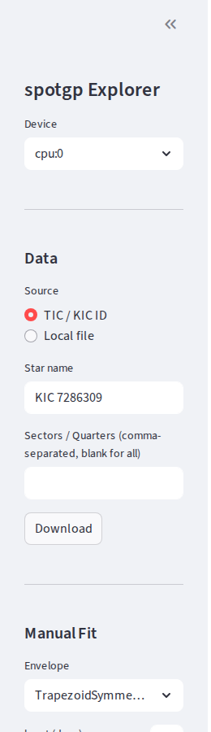
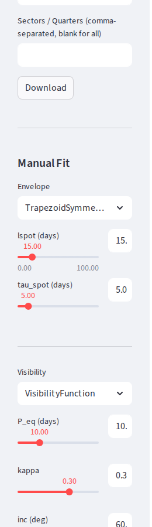
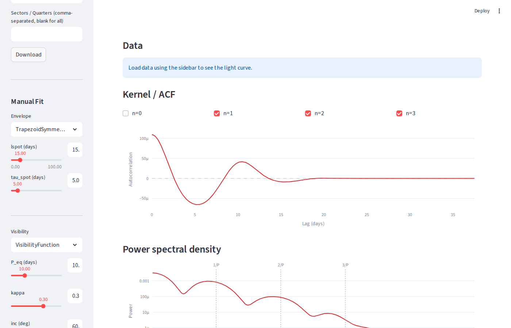

# Interactive Explorer (GUI)

The Streamlit app provides an interactive interface for loading light curves,
tuning model parameters by hand, running MAP optimization, and exporting
configs for batch fitting.

## Launching the app

```bash
make app                    # or: streamlit run scripts/app.py
```

The app opens at `http://localhost:8501`. On an HPC cluster, submit through
SLURM and tunnel the port:

```bash
sbatch scripts/run_app.slurm
```

## Sidebar controls

The sidebar on the left is organized into sections from top to bottom.
Work through them in order for a typical workflow.

### Device

Select the compute device (CPU, GPU, or TPU) for JAX computations. The
available options depend on your hardware.

### Data

Load a light curve from one of two sources:

- **TIC / KIC ID** — enter a target name (e.g. `TIC 441420236` or
  `KIC 7286309`) and optionally restrict to specific sectors or quarters.
  Click **Download** to fetch the light curve from MAST via lightkurve.
- **Local file** — enter the path to a CSV or `.npz` file and click **Load**.

After loading, data processing options appear:

- **Bin width dt** — bin the light curve in time (0 = no binning)
- **Normalize** — normalize flux to the per-segment median
- **Zero mean** — subtract the mean flux



### Manual Fit

Choose the model components and adjust their parameters with sliders:

**Envelope** — the spot evolution profile. Each type has its own parameters:

| Envelope | Parameters |
|----------|-----------|
| `TrapezoidSymmetricEnvelope` | `lspot`, `tau_spot` |
| `TrapezoidAsymmetricEnvelope` | `lspot`, `tau_em`, `tau_dec` |
| `ExponentialEnvelope` | `tau_spot` |
| `ExponentialAsymmetricEnvelope` | `tau_em`, `tau_dec` |
| `SkewedGaussianEnvelope` | `sigma_sn`, `n_sn` |

**Visibility** — the geometric projection function:

| Visibility | Parameters |
|------------|-----------|
| `VisibilityFunction` | `P_eq`, `kappa`, `inc` |
| `EdgeOnVisibilityFunction` | `P_eq` |
| `FullGeometryVisibilityFunction` | `P_eq`, `kappa`, `inc` |

**Latitude distribution** — where spots appear on the stellar surface:

| Distribution | Parameters |
|-------------|-----------|
| Uniform | (none) |
| Uniform Band | `min_lat`, `max_lat` |
| Butterfly | `phi0`, `sigma_phi` |

**log sigma_k** — the log amplitude of the kernel.

Every slider is paired with a number input box for precise values.

Click **Generate** to compute the model kernel with the current parameters.
Click **Predict** to compute the GP prediction on the loaded data.



### Optimize Fit

Run a MAP (maximum a posteriori) optimization on the loaded data:

1. Select the parameters to fit from the multiselect (defaults to all free
   parameters).
2. Adjust the bounds for each selected parameter using the min/max inputs.
3. Set the number of restarts.
4. Set the save path for the HDF5 result file.
5. Click **Run MAP Fit**.

After the fit completes, the MAP kernel and GP prediction are overlaid on
the manual model in the main panel plots. Click **Save results** to write
the fit to an HDF5 file.


### Export

Export the current sidebar settings as a YAML config file for use with the
command-line runner:

1. Set the output path (defaults to `configs/<star_name>.yaml`).
2. Click **Export config**.

The exported config includes the model, bounds, solver, and fitting
settings. Run it with:

```bash
python scripts/run_fit.py configs/<star_name>.yaml
```

## Main panel

The main panel displays interactive Plotly plots that update when you click
**Generate** or complete a MAP fit.

### Data

The light curve scatter plot. When a GP prediction or MAP fit is available,
the mean and 2-sigma envelope are overlaid.


### Kernel / ACF

The model autocovariance function compared to the data ACF (when data is
loaded). Use the **n=0, 1, 2, 3** checkboxes to toggle harmonic components.
These checkboxes filter both the manual model and MAP kernel curves.



### Power spectral density

The model PSD with vertical dotted lines at harmonics of the rotation
frequency (1/P, 2/P, 3/P). The data PSD is shown when data is loaded.

### Single-spot flux

Simulated flux from a single spot with adjustable longitude, latitude,
contrast, and duration. Shows both the spot evolution envelope and the
rotational modulation.

### Model equations

Expandable section showing the symbolic (SymPy) expressions for the
envelope, visibility, and latitude distribution functions with the current
parameter values substituted in.

### MAP Results

After running a MAP fit, displays the negative log posterior and a table of
the fitted parameter values.

## Typical workflow

1. **Load data** — enter a star ID and download, or load a local file
2. **Adjust model** — choose envelope/visibility types and tune sliders to
   roughly match the kernel to the data ACF
3. **Generate** — compute the model kernel to compare with the data
4. **Optimize** — select parameters, set bounds, run MAP fit
5. **Inspect** — check the MAP kernel/PSD overlays and parameter table
6. **Export** — save the config YAML for a full run with sampling


